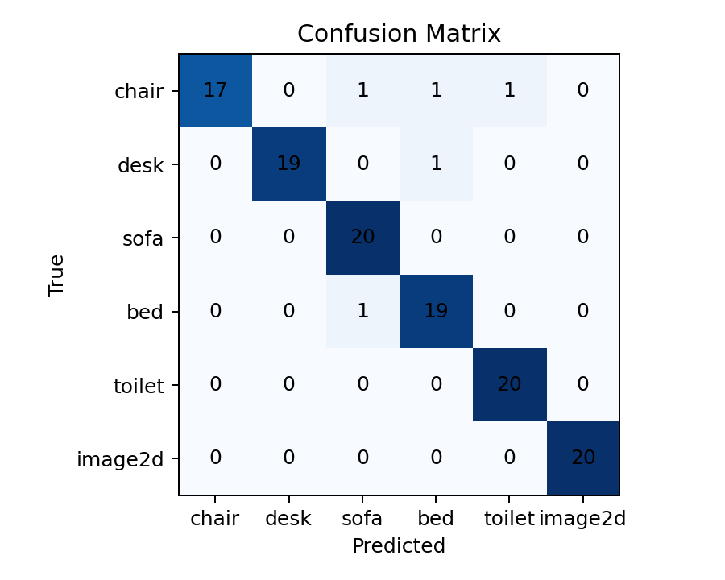
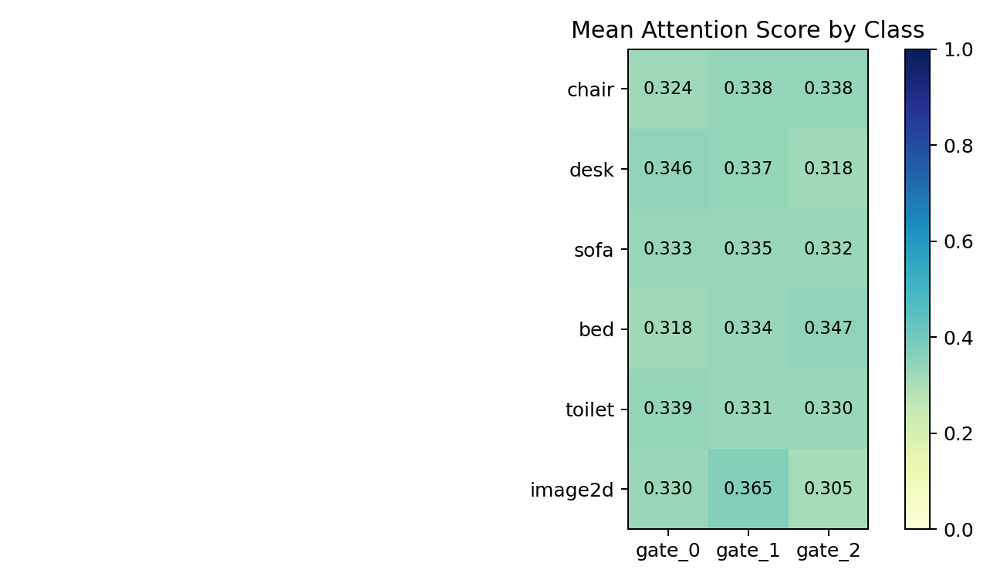

# 多门控切片融合方法实验对比与结果分析

## 实验目的与设置

为分析激光距离选通切片在目标识别任务中的有效性，本文在六分类数据集上比较不同输入方式和不同特征融合方式的识别性能。数据集包含五类三维目标（chair、desk、sofa、bed、toilet）以及额外构造的二维异常类 `image2d`。其中，`image2d` 样本由一个含有目标信息的切片和两个全黑切片组成，用于检验网络对二维退化输入的识别能力。

本文的实验重点不局限于某一种注意力结构，而是比较不同切片融合方法在准确率、稳定性、模型复杂度和计算时间方面的差异。所有方法使用相同的切片 CNN 编码器。每个门控切片首先被编码为 128 维特征向量，随后通过不同融合策略得到样本级特征并完成分类。

四种融合方式如下：

| 方法 | 是否使用注意力 | 融合方式 | 主要特点 |
|---|---|---|---|
| Mean | 否 | 三个切片特征等权平均 | 结构最简单，参数和计算开销最低 |
| Attention | 是 | 学习三个切片权重并加权求和 | 能自适应调整切片贡献，但会把多切片信息压缩到一个特征向量 |
| Attention-residual | 是 | 注意力加权融合 + 拼接残差分支 | 在保留切片权重的同时补充拼接特征信息 |
| Concat | 否 | 三个切片特征直接拼接 | 保留信息最多，准确率最高，但分类器输入维度更大 |

其中，attention-residual 的融合形式为：

```text
f_att = sum_i alpha_i f_i
f_res = MLP([f_0, f_1, f_2])
f = f_att + f_res
```

需要说明的是，本文后续讨论将 concat 视为当前实验中准确率最高的经验基线，而不是严格的理论上限。它的优势来自完整保留三个切片的特征信息，但同时也带来更大的分类器输入维度和较弱的切片贡献解释能力。

## 多切片输入与单切片输入对比

首先比较完整三切片输入与单切片输入的差异，以验证多个门控切片是否确实提供了互补信息。该组实验使用相同的 attention 融合模型，仅改变输入形式。`single-gate` 表示只输入一个真实切片；`single-gate-black` 表示仍保持三切片张量形式，但只有一个切片包含图像信息，其余两个切片置为全黑。

| 输入方式 | 有效图像切片 | Seed 42 | Seed 332 | Seed 2026 | 平均准确率 | 标准差 |
|---|---|---:|---:|---:|---:|---:|
| Multi-slice | gate_0 + gate_1 + gate_2 | 94.17% | 90.83% | 93.33% | 92.78% | 1.73% |
| Single-gate | gate_0 | 80.00% | 75.83% | 85.00% | 80.28% | 4.59% |
| Single-gate | gate_1 | 82.50% | 81.67% | 82.50% | 82.22% | 0.48% |
| Single-gate | gate_2 | 84.17% | 81.67% | 86.67% | 84.17% | 2.50% |
| Single-gate-black | gate_0 | 82.50% | 75.00% | 86.67% | 81.39% | 5.91% |
| Single-gate-black | gate_1 | 78.33% | 77.50% | 78.33% | 78.06% | 0.48% |
| Single-gate-black | gate_2 | 85.00% | 81.67% | 83.33% | 83.33% | 1.67% |

结果显示，完整三切片输入的平均准确率为 92.78%，明显高于任意单切片输入。最佳单切片结果为 gate_2，平均准确率为 84.17%，仍低于完整多切片输入 8.61 个百分点。`single-gate-black` 对照也未达到完整三切片输入的性能，说明准确率提升并不只是来自输入张量形式或黑色占位模式，而是来自多个真实深度切片之间的互补判别信息。

这一结果说明，在当前仿真数据中，不同门控切片包含的目标结构并不完全冗余。单个切片只能观察到部分深度范围内的形状信息，而多切片输入能够提供更完整的目标深度结构，因此更有利于分类。

## 融合方法准确率对比

在确认多切片输入有效后，进一步比较不同融合方法对分类结果的影响。图 1 展示了四种融合策略在六分类任务上的结果。柱状图表示三个随机种子的平均最优验证准确率，黑色误差线表示不同随机种子之间的标准差。


**图 1 不同多切片融合方法的六分类识别准确率对比**

| 融合方法 | Seed 42 | Seed 332 | Seed 2026 | 平均准确率 | 标准差 |
|---|---:|---:|---:|---:|---:|
| Mean | 92.50% | 89.17% | 94.17% | 91.94% | 2.55% |
| Attention | 94.17% | 90.83% | 93.33% | 92.78% | 1.73% |
| Attention-residual | 95.83% | 93.33% | 95.00% | 94.72% | 1.27% |
| Concat | 96.67% | 93.33% | 95.83% | 95.28% | 1.73% |

从平均准确率看，concat 取得最高结果，为 95.28%。这说明在当前数据规模和网络结构下，直接保留三个切片的完整特征信息对分类最有利。Concat 将三个 128 维切片特征拼接为 384 维特征，分类器可以自由学习不同切片之间的组合关系，因此具有较强的表达能力。

Attention-residual 的平均准确率为 94.72%，略低于 concat 0.56 个百分点，但高于原始 attention 1.94 个百分点。该结果说明，仅使用注意力加权求和会压缩切片信息，而引入残差分支后可以补充被压缩的拼接特征，从而显著提高性能。

Mean 融合的平均准确率最低，为 91.94%。它没有额外参数，也不区分不同切片的重要性，因此可以看作最简单的融合基线。Attention 相比 mean 提升 0.84 个百分点，说明自适应权重有一定作用，但提升幅度有限。总体来看，当前结果更强调“多切片特征如何保留和融合”对性能的影响，而不是单纯说明注意力机制本身一定优于非注意力方法。

## 计算复杂度与时间开销分析

除了准确率，实际系统还需要考虑计算时间和部署成本。当前实验结果文件中已经记录了各方法的准确率，但尚未在同一硬件上统一记录训练时间和推理时间。因此，本节先从结构复杂度角度分析不同方法的预期计算开销，并建议后续在 RTX 3090 上补充统一测速结果。

四种方法的 CNN 切片编码器完全相同，因此主要差异来自融合层和分类器输入维度。

| 方法 | 融合层额外计算 | 分类器输入维度 | 计算开销预期 | 说明 |
|---|---|---:|---|---|
| Mean | 极低 | 128 | 最低 | 只做特征平均，适合低开销基线 |
| Attention | 低 | 128 | 略高于 Mean | 需要计算三个切片的权重和 softmax |
| Attention-residual | 中等 | 128 | 高于 Attention | 额外引入拼接残差投影分支 |
| Concat | 低到中等 | 384 | 高于 Mean，通常低于复杂残差结构 | 融合本身简单，但分类器输入维度增大 |

从结构上看，mean 的计算开销最低，但准确率也最低。Concat 的融合操作本身非常简单，只是特征拼接；它的主要额外开销来自分类器输入从 128 维增加到 384 维。Attention-residual 需要同时计算注意力权重和残差投影，因此结构更复杂，理论计算量也更高。

需要注意的是，在当前网络中，绝大部分计算量来自共享 CNN 切片编码器。由于四种融合方法都要对三个切片进行 CNN 特征提取，所以实际推理时间差异可能不会像融合层结构差异那样明显。换言之，融合层会影响参数量和最后分类阶段的计算，但整体运行时间仍主要由 CNN 前端决定。

为了使论文中的计算时间对比更严谨，建议后续在同一台 RTX 3090 上补充以下指标：

| 指标 | 含义 |
|---|---|
| Params | 模型参数量 |
| Inference time / sample | 单个样本平均推理时间 |
| FPS | 每秒可处理样本数 |
| Training time / epoch | 单个 epoch 的训练时间 |
| GPU memory | 推理或训练阶段显存占用 |

论文中可以将计算时间表述为：

```text
所有方法在相同 GPU、相同 batch size 和相同输入分辨率下测试。
推理时间统计时先进行若干 warm-up，再记录多轮前向传播的平均耗时。
```

在补充测速结果之前，不建议直接声称某个方法在真实运行时间上最快。当前只能根据结构判断：mean 的融合部分最轻量，concat 的准确率最高且融合操作简单，attention-residual 在准确率和结构复杂度之间取得折中。

## 混淆矩阵结果分析

为进一步分析模型在不同类别上的表现，选取 seed 42 的 attention-residual 模型进行混淆矩阵分析。该模型的最优验证准确率为 95.83%，验证集每类包含 20 个样本。



**图 2 attention-residual 模型在六分类验证集上的混淆矩阵**

| 真实类别 \ 预测类别 | chair | desk | sofa | bed | toilet | image2d |
|---|---:|---:|---:|---:|---:|---:|
| chair | 17 | 0 | 1 | 1 | 1 | 0 |
| desk | 0 | 19 | 0 | 1 | 0 | 0 |
| sofa | 0 | 0 | 20 | 0 | 0 | 0 |
| bed | 0 | 0 | 1 | 19 | 0 | 0 |
| toilet | 0 | 0 | 0 | 0 | 20 | 0 |
| image2d | 0 | 0 | 0 | 0 | 0 | 20 |

从类别结果看，`image2d`、sofa 和 toilet 均达到 100% 分类准确率，desk 和 bed 分别为 95%，主要误差集中在 chair 类。`image2d` 没有与任何三维目标类别发生混淆，说明网络可以有效区分正常三维门控切片序列和二维退化切片序列。

Chair 类有 3 个样本分别被误分为 sofa、bed 和 toilet。这说明部分家具类目标在门控切片表示下可能存在局部轮廓相似性。例如椅背、扶手、支撑结构在某些深度切片中可能与其他家具类别的局部结构接近。该结果提示后续可以从两个方向改进：一是增加相似家具类别的样本数量和姿态变化；二是改进物理仿真切片，使不同类别的深度结构差异更充分地表现出来。

## 切片权重的辅助分析

虽然本文不再把注意力机制作为唯一主线，但 attention 和 attention-residual 的切片权重仍可作为辅助分析工具，用于观察模型如何利用不同门控切片。图 3 展示了 seed 42 的 attention-residual 模型在各类别上的平均切片权重。



**图 3 attention-residual 模型在不同类别上的平均切片权重**

| 类别 | gate_0 | gate_1 | gate_2 | 最高权重切片 |
|---|---:|---:|---:|---|
| chair | 0.3238 | 0.3383 | 0.3378 | gate_1 |
| desk | 0.3457 | 0.3366 | 0.3177 | gate_0 |
| sofa | 0.3335 | 0.3347 | 0.3318 | gate_1 |
| bed | 0.3184 | 0.3342 | 0.3474 | gate_2 |
| toilet | 0.3394 | 0.3306 | 0.3301 | gate_0 |
| image2d | 0.3297 | 0.3649 | 0.3054 | gate_1 |

这些结果说明，不同类别对三个门控切片的利用方式并不完全相同。例如，desk 和 toilet 的最高权重出现在 gate_0，bed 的最高权重出现在 gate_2，而 chair、sofa 和 image2d 的最高权重出现在 gate_1。这可以作为多切片输入具有类别相关深度信息的辅助证据。

对于 `image2d` 类，含目标信息切片的平均权重为 0.1752，而全黑切片的平均权重为 0.4124。该现象说明，切片权重并不等同于视觉显著性，而更接近分类判别贡献。对于二维异常类而言，两个全黑切片本身就是区别于正常三维门控输入的重要模式，因此模型会将其作为判别依据。

## 讨论

综合以上结果，几种融合方法呈现出不同特点。

Mean 方法结构最简单，适合作为低复杂度基线。它的准确率低于其他方法，说明对三个切片等权处理不能充分利用不同深度切片之间的差异。

Attention 方法引入自适应权重后略优于 mean，但提升幅度有限。这说明仅靠加权求和并不能完全发挥多切片输入的优势，因为加权求和会把三个切片压缩成一个 128 维特征，部分切片间组合信息可能在融合过程中损失。

Attention-residual 方法在 attention 的基础上加入残差投影分支，平均准确率提升到 94.72%，并且标准差最低，为 1.27%。这说明它在准确率和稳定性上都有较好表现，但计算结构也比 mean 和普通 attention 更复杂。

Concat 方法取得最高准确率 95.28%。它的优势是完整保留三个切片的特征，让分类器直接学习多切片组合关系。其缺点是分类器输入维度变大，切片贡献不够直观，并且当切片数量变化时需要调整后续分类器结构。因此，concat 可以作为当前实验中准确率最优的实用方案，也可以作为评估其他融合方法的高性能对照。

如果论文更强调最终识别性能，可以将 concat 作为主结果进行讨论；如果同时强调切片贡献分析和结构折中，可以将 attention-residual 作为重点方法，并用 concat 作为最高准确率对照。当前更稳妥的写法是：本文比较多种多切片融合策略，结果表明 concat 取得最高准确率，而 attention-residual 在接近 concat 准确率的同时提供了更好的切片级分析能力。

## 小结

本文实验表明：

1. 完整三切片输入明显优于单切片输入，证明多门控切片提供了互补判别信息。
2. 不同融合方法在准确率和结构复杂度上存在差异，concat 准确率最高，attention-residual 稳定性较好，mean 计算最简单。
3. 当前实验尚缺少统一硬件下的真实计算时间统计，后续应在 RTX 3090 上补充推理时间、FPS、训练时间和显存占用。
4. `image2d` 类能够被模型有效识别，说明网络可以区分正常三维切片序列和二维退化输入。

因此，后续论文不必只围绕注意力机制展开，而可以将重点放在多门控切片输入下不同融合策略的综合对比，包括准确率、稳定性、计算开销和结果可解释性。
